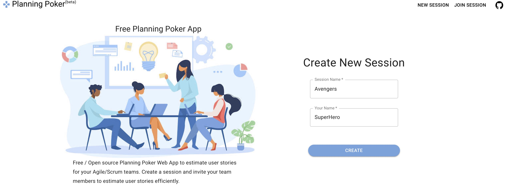
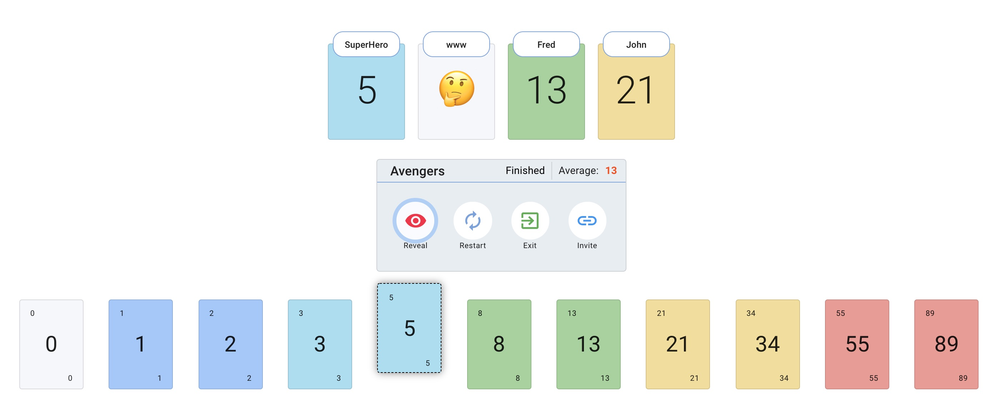

<h1 align="center">Planning Poker App</h1>

Free / Open source Scrum/Agile Planning Poker Web App to estimate user stories for the Agile/Scrum teams. Create session and invite team members to estimate user stories efficiently. Intuitive UI/UX for voting the story points, showing team members voting status with emojis(👍 - Voting Done, 🤔 - Yet to Vote). Session Moderator has full control on revealing story points and restarting the session.

<div align="center">
  
[](https://github.com/hellomuthu23/planning-poker/actions/workflows/build-and-tests.yml)
[](https://github.com/hellomuthu23/planning-poker/actions/workflows/deploy-to-firebase-on-master.yml)

</div>

## Live Site

- <https://planning-poker-agile.web.app/>

## Home Page



## Active Session



## Features

1. Create new Session(Fibonacci or TShirt size)
2. Join Session
3. Invite Link
4. Session controller - Moderator can Reveal and restart the session anytime.
5. Reveal - Reveal the cards for all users
6. Voting status - Users Cards show voting status using emojis - 👍 - Voting Done, 🤔 - Yet to Vote

## Tech Stack

1. React - Frontend
2. Material-ui - UI Components
3. Firestore - Database
4. Firebase - Hosting

## How to run the app locally for development

1. Clone the repo

    ```bash
    git clone https://github.com/hellomuthu23/planning-poker.git
    ```

2. Run `yarn` command to install the required npm package.
3. Run `yarn start` to start the app.
4. Access the app at `http://localhost:3000`.
5. We use the same production database for local development too, so avoid creating too many new sessions and re-use existing one.

## Development Guidelines

1. Keep it simple as much as possible
2. Add required unit tests
3. Use strong type always
4. Use functional and hooks based approach for components
5. Avoid adding new colors
6. Use css until we have scss in place
7. Don't duplicate code and use service folder to keep non-component/shared codes

## Pending features open to development

1. Support for custom voting options
2. Remove a user in session
3. Add timer
4. Export options
5. Preserve history of voting and show it in session
6. Provide option to enter user story name
7. Make the default Session name random
8. Delete Session

## Tech Depts

1. Add Semantic Release to generate changelog and release notes
2. Add missing unit tests for services
3. Add cookie notice
